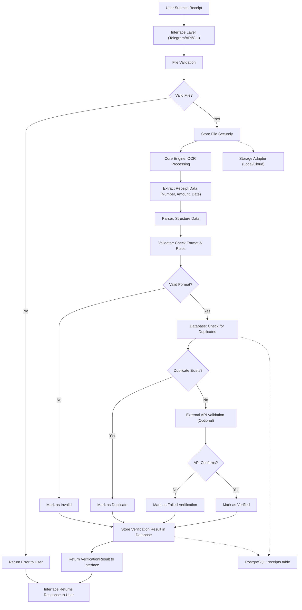

---

## 1. Background & Motivation

In financial transactions, proof of payment is often submitted as screenshots or PDF receipts. Manual verification is slow, error-prone, and susceptible to fraud such as duplicate or altered receipts.

While several apps attempt to automate verification, most solutions are tied to a single interface or platform. There is a lack of **modular, reusable systems** that allow developers to plug in their own interface (Telegram bot, web app, CLI, etc.) while relying on a robust verification engine.

This project aims to build a **flexible, modular receipt verification engine** that leverages OCR, database-driven duplicate detection, and optional API-based validation, allowing users to adopt their own front-end or workflow.

---

## 2. Objectives

The project has three simultaneous goals:

1. **Learning Sandbox:**
    - Explore OCR, Python backend programming, and system design.
    - Understand database interaction and file handling.
2. **Portfolio-Grade System:**
    - Create a reusable, modular engine with clean architecture.
    - Implement best practices in commit discipline, documentation, and testing.
3. **Foundation for Fintech Infrastructure:**
    - Build a pluggable, extensible system for future real-world applications.
    - Consider security, concurrency, idempotency, and error-handling from day one.

Specific objectives:

- Build a Python-based core engine for receipt verification.
- Implement OCR for extracting receipt data.
- Validate receipts using a mock/external API or structured simulation.
- Detect duplicate submissions via database constraints.
- Enable users to plug in their own interfaces or databases.
- Implement secure and reliable file storage for uploaded receipts.
- Structure the project for future expansion to production-grade fintech systems.

---

## 3. Technical Approach

### 3.1 Core Engine

- **Language:** Python
- **Responsibilities:**
    - OCR processing abstraction (Tesseract or equivalent)
    - Receipt parsing logic (receipt number, amount, date)
    - Validation rules (format checks, external verification API)
    - Duplicate detection logic
    - Returns a `VerificationResult` object for downstream use

**Example Domain Object:**

```python
class VerificationResult:
    receipt_number: str
    status: Literal["verified", "duplicate", "invalid", "failed"]
    error_message: Optional[str]
    timestamp: datetime
```

---

### 3.2 Database Layer (Persistence)

- Use PostgreSQL initially; allow later pluggable database implementations via an abstract repository interface.
- Track uploaded receipts, verification status, timestamps, and metadata.
- Enforce **unique constraints** on receipt numbers to prevent duplicates.
- Optional: Implement audit trail for each verification attempt.

---

### 3.3 Interface Layer (Adapters)

- Build adapters for different usage scenarios:
    - Telegram bot interface
    - REST API (FastAPI)
    - CLI or web interface
- Each adapter interacts only with the **core engine**, never implementing verification logic itself.

---

### 3.4 File Handling & Security

- Store uploaded files securely:
    - **Local storage** for learning purposes.
    - Optionally integrate **cloud storage** (AWS S3, GCP, Azure) for production-level reliability.
- File validation: limit types (PNG, JPG, PDF) and size (<5 MB).
- Use unique filenames and access control.
- Track processing status in database (pending, verified, failed).

---

### 3.5 OCR & Parsing

- OCR library: Tesseract OCR
- Preprocess images: resize, grayscale, thresholding
- Extract receipt numbers using regex or structured parsing
- Handle OCR errors gracefully; flag uncertain results for manual review

---

### 3.6 Reliability & Concurrency

- Asynchronous processing for OCR to avoid blocking requests
- Handle simultaneous verification requests safely
- Retry mechanism for failed API calls
- Deterministic outputs: same input → same verification result

---

## 4. Project Structure (Proposed)

```
receipt_verifier/
│
├── core/                     # Core engine logic
│   ├── ocr.py
│   ├── parser.py
│   ├── validator.py
│   ├── fraud_checks.py
│   └── service.py
│
├── infrastructure/           # Database & storage adapters
│   ├── postgres_repository.py
│   └── storage_adapter.py
│
├── api/                      # REST API layer (FastAPI)
│   └── main.py
│
├── bot/                      # Telegram bot adapter
│   └── telegram_bot.py
│
├── tests/                    # Unit and integration tests
│
└── scripts/                  # Utility scripts for setup & deployment
```

---

## 5. Security Considerations

- Validate file types and sizes
- Generate unique filenames to avoid collisions
- Serve files only via controlled application endpoints
- Sanitize OCR outputs before using them in database queries
- Rate limiting for API endpoints
- Handle database transactions safely to prevent race conditions

---

## 6. Expected Learning Outcomes

By completing this project, you will:

- Build a **modular, reusable Python engine**
- Gain hands-on experience with **FastAPI, databases, and OCR**
- Learn **secure file handling and validation**
- Understand **system design and clean architecture principles**
- Learn **Git workflow discipline**: meaningful commits, branching, merging
- Learn to **abstract infrastructure** for flexibility and scalability
- Build a portfolio-grade project demonstrating professional engineering practices

---

## 7. Timeline (4 Weeks – Semester Break)

| Week | Tasks |
| --- | --- |
| 1 | Setup Python project, Git repo, PostgreSQL, basic FastAPI structure |
| 2 | Implement core engine: OCR, parsing, verification logic, basic tests |
| 3 | Add database layer with duplicate detection and status tracking; handle edge cases |
| 4 | Build adapters (Telegram bot, REST API), finalize documentation, testing, and code cleanup |

---

## 8. Scope & Limitations

- Educational project; no real financial transactions will be handled.
- External bank API calls may be simulated for demonstration purposes.
- Not intended to be deployed for production banking without proper compliance.
- Focus is on **modularity, reliability, and engineering skill development**.

---

## 9. Success Criteria

- Core engine works correctly with unit tests
- Receipts can be uploaded and processed reliably
- Duplicate detection works correctly
- Multiple adapters (Telegram bot, REST API) work seamlessly with engine
- Project is fully documented, structured, and version-controlled

---

**Summary:**

This project is designed to be **a learning platform, a portfolio-grade backend system, and a foundation for fintech-grade infrastructure**. By separating core logic from adapters, abstracting storage, and focusing on reliability and security, this project will teach **real engineering skills** while producing something demonstrable and professional.

---


